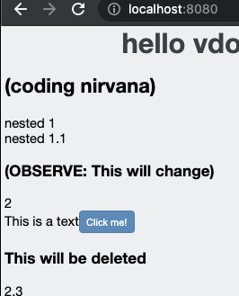

# td-vdom

basically react :innocent:

minimal js library with jsx support for building functional and stateful components (hooks to come), inspiration and motivation based solely on learning virtual dom and how libraries like [React](https://github.com/facebook/react) actually work.

## As it stands

Build your app with the beloved [JSX](https://reactjs.org/docs/introducing-jsx.html):

```javascript
const root = document.getElementById("root");

var Step1 = (
  <div>
    <h1 className="header">hello vdom!</h1>
    <h2>(coding nirvana)</h2>
    <div>nested 1<div>nested 1.1</div></div>
    <h3>(OBSERVE: This will change)</h3>
    {2 == 1 && <div>Render this if 2==1</div>}
    {2 == 2 && <div>{2}</div>}
    <span>This is a text</span>
    <button onClick={() => alert("Hi!")}>Click me!</button>
    <h3>This will be deleted</h3>
    2,3
  </div>
);

vdom.render(Step1, root);
```

and watch the real DOM come to life



..features, docs, everything else... more to come.. :v:
