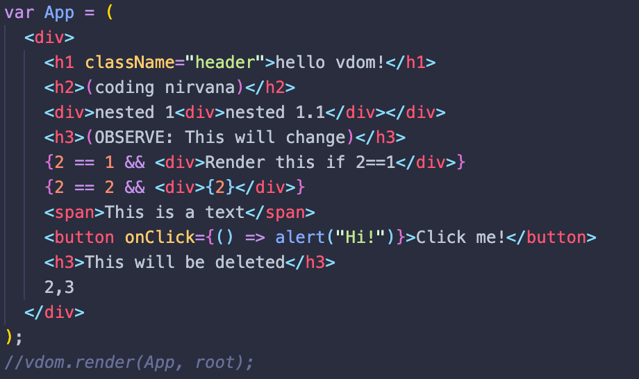
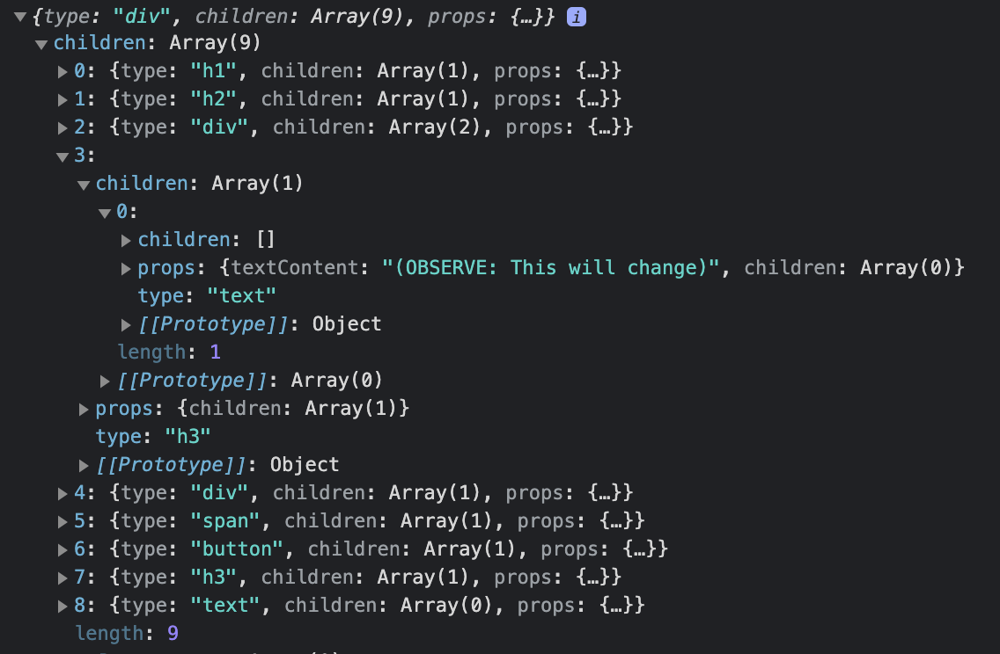

# td-vdom

basically react :innocent:

minimal js library with jsx support for building functional and stateful components (hooks to come), inspiration and motivation based solely on learning virtual dom and how libraries like [React](https://github.com/facebook/react) actually work.

## As it stands

Build your app with [JSX](https://reactjs.org/docs/introducing-jsx.html):

it will return an object, with an array of children representing each node.

..features, docs, everything... more to come.. :v:
